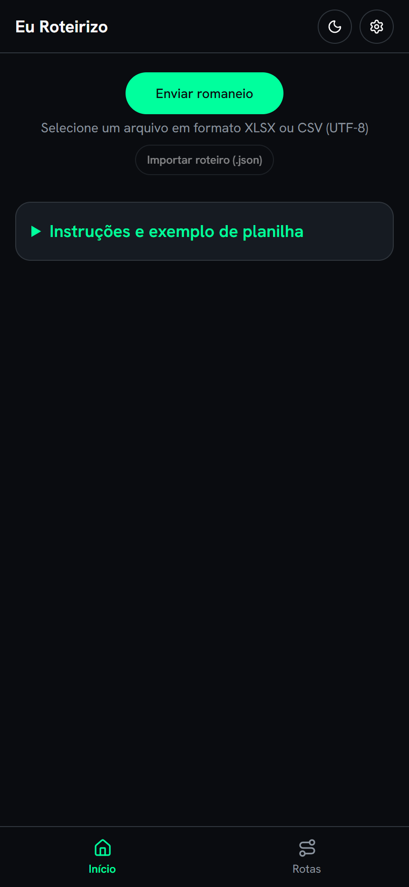
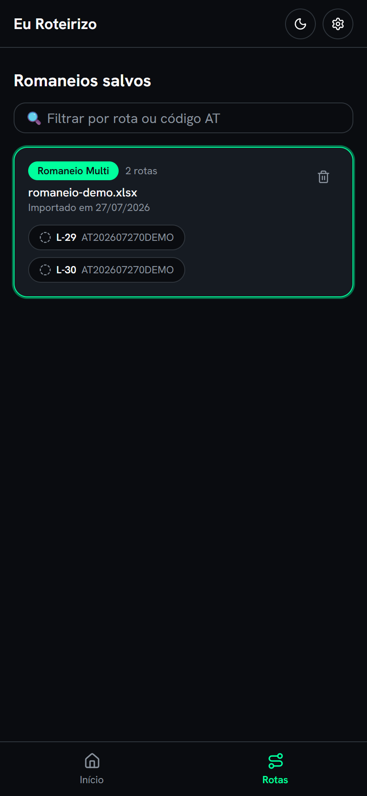
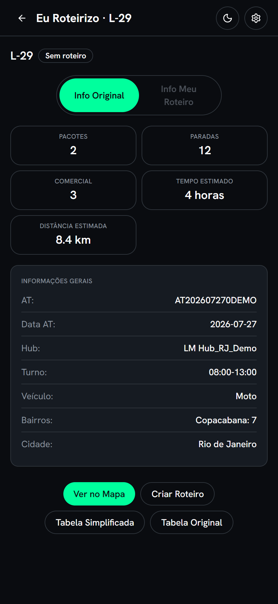
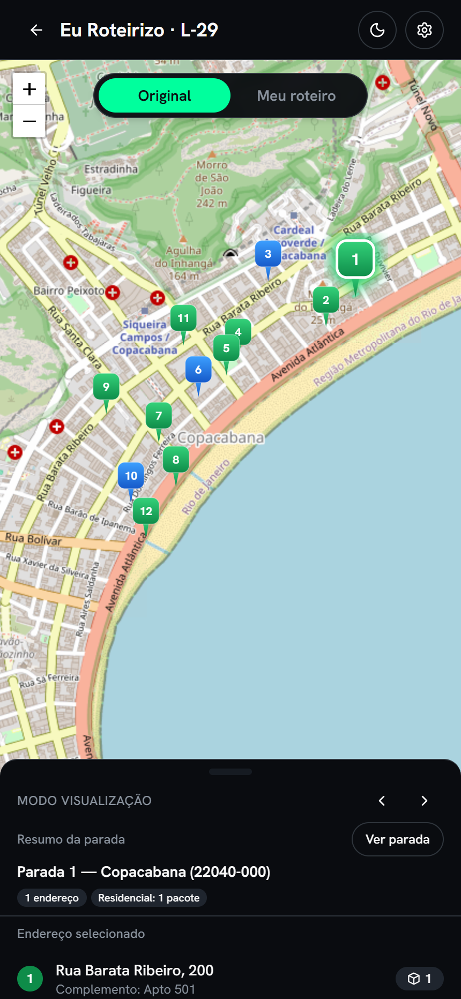
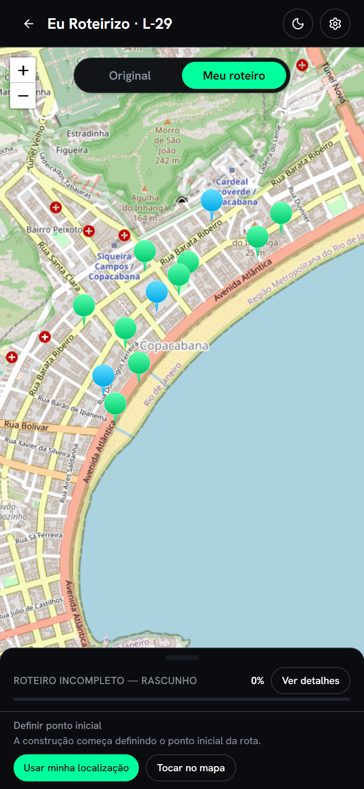
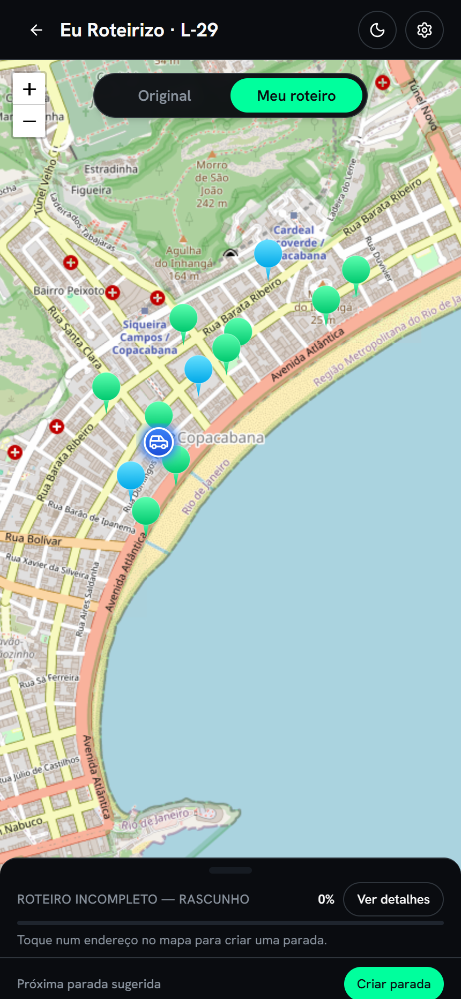

# 🚚 Eu Roteirizo

**PWA que transforma o romaneio de entregas numa rota comparadas de entregas a pé, montada sobre o grafo de ruas do OpenStreetMap sem backend, sem conta e sem API de roteirização paga.**

> ### ⚠️ Protótipo em desenvolvimento
>
> Este é um **projeto pessoal de aprendizado, em construção ativa**. Não é um produto lançado: não tem
> versão estável, não está em loja de aplicativos e o único ambiente publicado é de **testes**.
> O modo de visualização está maduro; o construtor de roteiro é recente; a execução da rota
> **ainda não existe**. O estado real, funcionalidade por funcionalidade, está em
> [Estado atual](#-estado-atual).
>
> **Desenvolvido com auxílio intensivo de IA** (Claude). O que isso significou na prática está em
> [Sobre o uso de IA](#-sobre-o-uso-de-ia).

---

## O problema

Entregador de última milha recebe uma planilha com dezenas de endereços já ordenados para o **veículo**.
Só que boa parte da entrega urbana é feita **a pé**: estaciona-se uma vez e caminha-se um quarteirão
inteiro. A ordem da planilha não ajuda nessa hora, e as ferramentas de roteirização que existem ou
cobram por requisição, ou assumem que cada parada é uma movimentação com veículo.

**Eu Roteirizo** lê esse romaneio e oferece duas leituras dele:

| Modo | O que faz |
|---|---|
| **Original** | Mostra a planilha como ela é: mapa com marcador por endereço, painel com detalhe da parada, tabelas e sumário. |
| **Meu roteiro** | Deixa você **construir a rota manualmente parada por parada**: define onde o veículo para (por padrão no mesmo endereço de entrega, permitindo alteração), agrupa endereços por raio de caminhada e calcula o percurso real pelas ruas mostrando tempo e distância. O local onde o veículo estaciona em cada parada é ponto de partida para a próxima, e o app sugere a próxima parada com base na posição que é independente dos endereços de entrega.

---

## 📱 Telas

Capturas do app **em execução**, processando um romaneio fictício de Copacabana.
Nenhuma é mockup — são o que o código faz hoje.

<table>
  <tr>
    <td align="center"><br><sub><b>Upload</b><br>XLSX ou CSV, lido no navegador</sub></td>
    <td align="center"><br><sub><b>Romaneios salvos</b><br>persistidos em IndexedDB</sub></td>
    <td align="center"><br><sub><b>Sumário</b><br>números derivados da rota</sub></td>
  </tr>
  <tr>
    <td align="center"><br><sub><b>Modo Original</b><br>marcadores SVG por tipo de local</sub></td>
    <td align="center"><br><sub><b>Meu roteiro</b><br>construção começa pelo início</sub></td>
    <td align="center"><br><sub><b>Parada do veículo</b><br>com próxima parada sugerida</sub></td>
  </tr>
</table>

---

## 🧭 O que tem de interessante aqui

O que me fez escolher este projeto como estudo não foi a tela — foi o que está atrás dela.

**Roteirização própria, sem API paga.** O app baixa a malha viária do OpenStreetMap (via Overpass),
monta um **grafo dirigido** em memória — mão única vira aresta ausente, não penalidade — e roda um
**A\* próprio** sobre ele. Nenhuma chamada ao Google Directions ou similar. Isso não foi capricho
técnico: a proposta só fecha se o custo por usuário for perto de zero. A decisão está registrada na
[ADR-002](docs/arquitetura/ADR/ADR-002.md).

**100% client-side, de verdade.** Sem servidor de aplicação, sem banco remoto, sem login. Romaneios,
roteiros e o cache do grafo vivem em **IndexedDB no aparelho**. O único componente de infraestrutura
é um Cloudflare Worker que faz proxy e cache dos tiles do mapa.

**Grafo com cache offline.** Baixar a malha de ruas é a operação mais cara do fluxo; ela é cacheada
por região, então a segunda entrada no modo roteiro é instantânea. O Overpass é um serviço público
com fila — quando ele devolve `429`/`504`, o app **retenta sozinho com backoff exponencial** em vez
de mostrar erro. (As capturas acima foram feitas com o Overpass retornando `504` três vezes seguidas;
o retry recuperou sem intervenção.)

**Domínio complexo isolado da UI.** A construção do roteiro é um `useReducer` puro
(`routeBuilderReducer`), testável sem renderizar nada. Não há biblioteca de estado global.

**Mobile-first porque o uso é na rua.** O alvo é alguém segurando o celular com uma mão, no sol,
entre uma entrega e outra. Toda calibração de gesto e espaçamento é constante nomeada e comentada
com o marcador `⚙️ MANUAL KNOB`, para ajustar num lugar só.

---

## 🛠️ Stack

| Camada | Escolhas |
|---|---|
| **Base** | React 18, TypeScript (strict), Vite 7 |
| **PWA** | `vite-plugin-pwa` (service worker, instalável) |
| **UI** | Tailwind CSS + shadcn/ui (Radix), tema próprio em tokens CSS |
| **Mapa** | Leaflet, tiles via Cloudflare Worker (proxy + cache) |
| **Dados** | SheetJS (XLSX/CSV), IndexedDB via `idb` |
| **Roteirização** | Overpass API (OSM) + grafo e A\* escritos no projeto |
| **Testes** | Vitest, Testing Library, `fake-indexeddb` |

---

## 📊 Estado atual

Números de **27/07/2026**.

**Funciona hoje**
- ✅ Leitura de romaneio XLSX/CSV, multi-rota (agrupado por corredor) ou rota única
- ✅ Persistência local dos romaneios, com deduplicação por hash SHA-256
- ✅ Navegação multi-tela com deep link (a URL carrega o modo — F5 e link compartilhado preservam o estado)
- ✅ Modo Original completo: mapa, marcadores por tipo de local, painel de parada, tabelas e sumário
- ✅ Modo Meu roteiro: ponto inicial por GPS/toque, paradas por raio de caminhada, âncora do veículo, ordem derivada, traçado real pelas ruas e estimativas de tempo
- ✅ PWA instalável, com o grafo de ruas cacheado para uso offline

**Ainda não existe**
- ❌ **Execução da rota** — marcar entrega como concluída, acompanhar progresso em campo (é a próxima fronteira)
- ❌ **Auto-roteirizar** — hoje o agrupamento de paradas é manual
- ❌ **Exportar/importar roteiro** em JSON (o botão na tela inicial é stub declarado)
- ❌ Backend, contas, sincronização entre aparelhos — fora do escopo por decisão de projeto

**Qualidade**

| | |
|---|---|
| Testes | **770** automatizados em 72 arquivos |
| Código | ~13.500 linhas em `src/` + ~10.600 de teste |
| Gates por tarefa | `tsc --noEmit` · `eslint` · `vitest` · `build` |
| Decisões registradas | 10 ADRs |
| Requisitos rastreados | 44 de 49 funcionais entregues |

> Transparência: **1 dos 770 testes está vermelho** hoje — um teste de retry que espera em relógio de
> parede e estoura o timeout padrão. Está rastreado como `TASK-BG-009` no backlog, não escondido.
> Correção conhecida, ainda não aplicada.

---

## ▶️ Rodando localmente

```bash
npm install
npm run dev          # http://localhost:5173
```

Para ver algo na tela é preciso um romaneio: um `.xlsx`/`.csv` com, no mínimo, as colunas
`Latitude` e `Longitude`. A coluna `Corridor Cage`, se existir, agrupa as entregas em rotas;
sem ela, o arquivo é tratado como rota única. A tela inicial traz um exemplo do formato
esperado em "Instruções e exemplo de planilha".

```bash
npm run test         # suíte
npm run lint         # eslint
npx tsc --noEmit     # tipos
npm run build        # build de produção
```

---

## 📚 Documentação

O repositório carrega mais documentação do que o normal para um projeto deste tamanho — foi
deliberado, e é metade do experimento:

- **[`docs/contexto-projeto-ai.md`](docs/contexto-projeto-ai.md)** — o retrato do projeto: stack real, estrutura, decisões inegociáveis
- **[`docs/arquitetura/ADR/`](docs/arquitetura/ADR/)** — 10 decisões arquiteturais com contexto e alternativas descartadas
- **[`docs/requisitos/`](docs/requisitos/)** — requisitos funcionais, regras de negócio e não-funcionais, rastreados até a tarefa que os implementou
- **[`docs/tarefas/`](docs/tarefas/)** — o histórico completo: toda tarefa registrada com plano aprovado, log de execução, decisões, gates e aprendizados
- **[`docs/dominios/divida-tecnica.md`](docs/dominios/divida-tecnica.md)** — dívidas assumidas, cada uma com o gatilho que manda revisitá-la

---

## 🤖 Sobre o uso de IA

Este projeto foi construído com **auxílio intensivo de IA** (Claude), e acho mais interessante ser
explícito sobre isso do que fingir o contrário.

A IA escreveu a maior parte do código. O que eu trouxe foi o **problema** — conheço a dor de quem
entrega —, as **decisões** de produto e arquitetura, e o **critério de aceite**: nenhuma tarefa fecha
sem `tsc`, `eslint`, `vitest` e `build` verdes, e funcionalidade de interface só é considerada pronta
depois de teste no aparelho real, porque suíte verde não prova conforto de uso na rua.

Para que isso não virasse geração de código sem rumo, o repositório inclui um **manual de operação do
agente** em [`.github/agents/`](.github/agents/): princípios, ciclo de tarefa, padrões de código,
checklists de revisão e modos de cerimônia proporcionais ao risco da mudança. Os registros em
`docs/tarefas/concluidas/` são a saída desse processo — dá para auditar como cada decisão foi tomada,
o que foi deliberadamente **não** feito, e onde o plano mudou no meio do caminho.

Boa parte do que aprendi aqui foi menos sobre React e mais sobre **como conduzir e revisar** trabalho
que não foi minha mão que digitou.

---

## 📄 Licença

Sem licença de código aberto. O código está público para **avaliação e portfólio**; todos os direitos
reservados. Se quiser usá-lo para algo, é só me chamar.

---

<sub>Projeto pessoal de <b>Thiago Silva</b> · em desenvolvimento desde junho de 2026 · dados das capturas são fictícios</sub>
