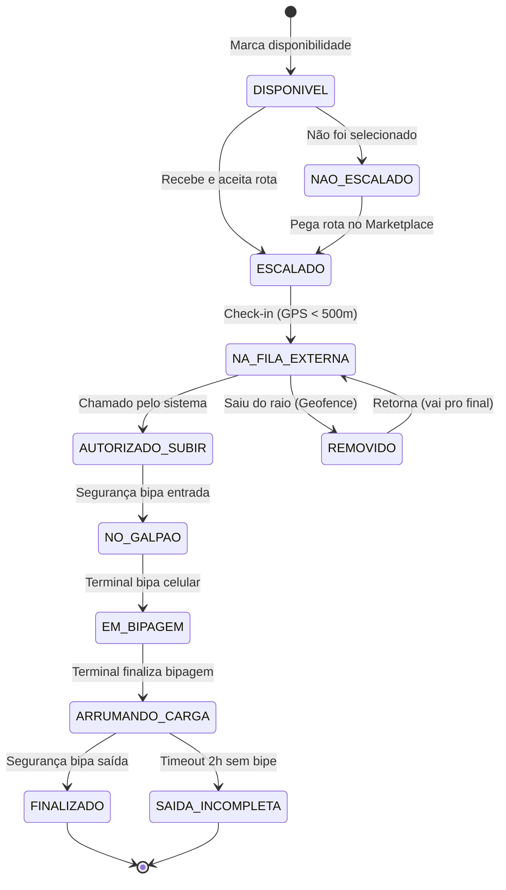

> ⚠️ **DRAFT: visão de arquitetura futura, NÃO implementada.** Este documento descreve um produto-alvo hipotético ("HubFlow Logistics": Next.js, Prisma, Supabase, NextAuth etc.) e **não corresponde ao código atual**, que é um PWA Vite + React (SPA, frontend-only) de visualização de rotas. Mantido como rascunho de caminhos possíveis. Para o estado real, ver `docs/CODIGO_COMENTADO.md`. (Origem: REV-001-A01.)

# 🏗️ Arquitetura Técnica - HubFlow Logistics

> Documento de especificação técnica para o sistema de gestão de entregas e fila virtual.

---

## 📦 Stack Tecnológica

### Frontend & Framework

| Tecnologia | Versão | Função |
|------------|--------|--------|
| **Next.js** | 14.x (App Router) | Framework fullstack React |
| **React** | 18.x | Biblioteca de UI |
| **TypeScript** | 5.x | Tipagem estática |
| **Tailwind CSS** | 3.x | Estilização utility-first |
| **shadcn/ui** | latest | Componentes acessíveis |

### Backend & Dados

| Tecnologia | Versão | Função |
|------------|--------|--------|
| **Next.js API Routes** | 14.x | Endpoints REST |
| **Prisma ORM** | 5.x | Acesso ao banco de dados |
| **PostgreSQL** | 15.x | Banco relacional (Supabase) |
| **NextAuth.js** | 5.x (Auth.js) | Autenticação |
| **Zod** | 3.x | Validação de schemas |

### Serviços Externos (Gratuitos)

| Serviço | Função | Limite Free |
|---------|--------|-------------|
| **Vercel** | Hosting & Deploy | 100GB/mês |
| **Supabase** | PostgreSQL + Storage | 500MB |
| **Cloudflare Workers** | Proxy tiles do mapa | 100k req/dia |
| **Pusher** | WebSocket (fila real-time) | 200k msg/dia |
| **Resend** | E-mails transacionais | 3k/mês |

### Bibliotecas Auxiliares

| Biblioteca | Função |
|------------|--------|
| **Leaflet** | Mapas interativos |
| **html5-qrcode** | Leitura de QR Code |
| **react-qr-code** | Geração de QR Code |
| **date-fns** | Manipulação de datas |
| **zustand** | Estado global simples |
| **lucide-react** | Ícones (já incluso no shadcn) |

---

## 🗄️ Modelo de Dados (Prisma Schema)

```prisma
// prisma/schema.prisma

generator client {
  provider = "prisma-client-js"
}

datasource db {
  provider = "postgresql"
  url      = env("DATABASE_URL")
}

// ========================
// MÓDULO: Identidade (IAM)
// ========================

enum UserRole {
  ADMIN_HUB
  ANALISTA
  MOTORISTA
  TERMINAL
  SEGURANCA
}

enum ModalType {
  MOTO
  NORMAL
  VOLUMOSO
}

model User {
  id            String    @id @default(cuid())
  email         String    @unique
  emailVerified DateTime?
  password      String    // Hash bcrypt
  role          UserRole
  createdAt     DateTime  @default(now())
  updatedAt     DateTime  @updatedAt

  // Relações
  motorista     Motorista?
  analista      Analista?
  terminal      Terminal?
}

model Motorista {
  id          String    @id @default(cuid())
  idSpx       String    @unique // ID externo do sistema SPX
  nome        String
  telefone    String
  placa       String
  modal       ModalType
  fotoUrl     String?
  score       Int       @default(100)
  
  userId      String    @unique
  user        User      @relation(fields: [userId], references: [id])
  
  // Relações
  escalas         Escala[]
  disponibilidades Disponibilidade[]
  filaEntradas    FilaVirtual[]
  bipagens        Bipagem[]
  
  createdAt   DateTime  @default(now())
  updatedAt   DateTime  @updatedAt
}

model Analista {
  id        String  @id @default(cuid())
  nome      String
  whatsapp  String?
  plantao   Boolean @default(false)
  
  userId    String  @unique
  user      User    @relation(fields: [userId], references: [id])
}

model Terminal {
  id        String  @id @default(cuid())
  nome      String  // Ex: "Mesa 1", "Mesa 2"
  hubId     String
  hub       Hub     @relation(fields: [hubId], references: [id])
  
  userId    String  @unique
  user      User    @relation(fields: [userId], references: [id])
  
  bipagens  Bipagem[]
}

// ========================
// MÓDULO: Hub e Rotas
// ========================

model Hub {
  id              String    @id @default(cuid())
  nome            String
  endereco        String
  latitude        Float
  longitude       Float
  raioGeofence    Int       @default(500) // metros
  
  // Configurações de distribuição (RF16)
  pctMoto         Int       @default(30)
  pctNormal       Int       @default(40)
  pctVolumoso     Int       @default(30)
  bufferGalpao    Int       @default(2) // RF15
  
  statusOperacional Boolean @default(true)
  
  terminais       Terminal[]
  rotas           Rota[]
  filaVirtual     FilaVirtual[]
  
  createdAt       DateTime  @default(now())
}

model Rota {
  id              String    @id @default(cuid())
  corridorCage    String    // Identificador da rota (ex: "A-1")
  turno           Turno
  modalRequerido  ModalType
  dataRota        DateTime
  
  // Dados do arquivo Excel
  totalPacotes    Int
  totalParadas    Int
  distanciaKm     Float
  tempoEstimado   String
  cidade          String
  bairros         String    // JSON ou texto separado por vírgula
  
  hubId           String
  hub             Hub       @relation(fields: [hubId], references: [id])
  
  escala          Escala?
  marketplace     MarketplaceRota?
  
  createdAt       DateTime  @default(now())
}

enum Turno {
  AM
  PM
}

// ========================
// MÓDULO: Escalas e Disponibilidade
// ========================

model Disponibilidade {
  id          String    @id @default(cuid())
  motoristaId String
  motorista   Motorista @relation(fields: [motoristaId], references: [id])
  
  data        DateTime
  turno       Turno
  confirmado  Boolean   @default(false) // RF05
  confirmedAt DateTime?
  
  @@unique([motoristaId, data, turno])
}

model Escala {
  id            String        @id @default(cuid())
  motoristaId   String
  motorista     Motorista     @relation(fields: [motoristaId], references: [id])
  
  rotaId        String        @unique
  rota          Rota          @relation(fields: [rotaId], references: [id])
  
  status        EscalaStatus  @default(PENDENTE)
  aceitoEm      DateTime?
  recusadoEm    DateTime?
  motivoRecusa  String?
  
  createdAt     DateTime      @default(now())
}

enum EscalaStatus {
  PENDENTE      // Aguardando aceite do motorista
  ACEITO        // Motorista aceitou
  RECUSADO      // Motorista recusou
  NO_SHOW       // Não compareceu
}

// ========================
// MÓDULO: Marketplace (RF08-11)
// ========================

model MarketplaceRota {
  id              String    @id @default(cuid())
  rotaId          String    @unique
  rota            Rota      @relation(fields: [rotaId], references: [id])
  
  disponivelEm    DateTime  @default(now())
  faseVisibilidade Int      @default(1) // 1=mesmo modal, 2=outros, 3=todos
  
  candidaturas    Candidatura[]
  atribuidaA      String?   // motoristaId se atribuída
  
  createdAt       DateTime  @default(now())
}

model Candidatura {
  id              String    @id @default(cuid())
  marketplaceId   String
  marketplace     MarketplaceRota @relation(fields: [marketplaceId], references: [id])
  
  motoristaId     String
  candidaturaEm   DateTime  @default(now())
  selecionado     Boolean   @default(false)
}

// ========================
// MÓDULO: Fila Virtual (RF12-16)
// ========================

model FilaVirtual {
  id            String        @id @default(cuid())
  motoristaId   String
  motorista     Motorista     @relation(fields: [motoristaId], references: [id])
  
  hubId         String
  hub           Hub           @relation(fields: [hubId], references: [id])
  
  senha         String        // Ex: "M-10", "C-05"
  modal         ModalType
  posicao       Int
  
  status        FilaStatus    @default(AGUARDANDO)
  checkInAt     DateTime      @default(now())
  chamadoAt     DateTime?
  removidoAt    DateTime?
  motivoRemocao String?
  
  // Geolocalização do check-in
  latitude      Float
  longitude     Float
  
  @@index([hubId, modal, status])
}

enum FilaStatus {
  AGUARDANDO        // Na fila externa
  AUTORIZADO_SUBIR  // Pode entrar no galpão
  NO_GALPAO         // Dentro do galpão
  EM_ATENDIMENTO    // Na mesa
  FINALIZADO        // Saiu
  REMOVIDO          // Saiu da área (geofence)
}

// ========================
// MÓDULO: Bipagem (RF17-22)
// ========================

model Bipagem {
  id            String        @id @default(cuid())
  motoristaId   String
  motorista     Motorista     @relation(fields: [motoristaId], references: [id])
  
  terminalId    String?
  terminal      Terminal?     @relation(fields: [terminalId], references: [id])
  
  tipo          TipoBipagem
  timestamp     DateTime      @default(now())
  
  // Para bipagem de terminal
  totalPacotes  Int?
  
  // Para cronômetro de arrumação
  tempoArrumacao Int?         // segundos
}

enum TipoBipagem {
  ENTRADA_GATE      // Segurança bipou entrada
  INICIO_TERMINAL   // Mesa iniciou carga
  FIM_TERMINAL      // Mesa finalizou
  SAIDA_GATE        // Segurança bipou saída
  FINALIZACAO_MANUAL // Analista encerrou
}

// ========================
// MÓDULO: Incidentes (RF25)
// ========================

model IncidenteRisco {
  id          String    @id @default(cuid())
  reportadoPor String   // motoristaId
  latitude    Float
  longitude   Float
  descricao   String
  ativo       Boolean   @default(true)
  
  createdAt   DateTime  @default(now())
  expiresAt   DateTime  // Auto-desativa após X horas
}
```

---

## 🔄 Máquina de Estados do Motorista



### Estados e Transições

| Estado | Descrição | Próximo Estado | Trigger |
|--------|-----------|----------------|---------|
| `DISPONIVEL` | Motorista marcou disponibilidade | `ESCALADO` ou `NAO_ESCALADO` | Sistema escala ou não |
| `ESCALADO` | Rota atribuída e aceita | `NA_FILA_EXTERNA` | Check-in no app |
| `NAO_ESCALADO` | Não foi selecionado | `ESCALADO` | Marketplace |
| `NA_FILA_EXTERNA` | Aguardando chamada | `AUTORIZADO_SUBIR` ou `REMOVIDO` | Sistema ou Geofence |
| `AUTORIZADO_SUBIR` | Pode entrar no galpão | `NO_GALPAO` | Bipe de entrada |
| `NO_GALPAO` | Dentro do galpão | `EM_BIPAGEM` | Bipe do terminal |
| `EM_BIPAGEM` | Recebendo pacotes | `ARRUMANDO_CARGA` | Terminal finaliza |
| `ARRUMANDO_CARGA` | Organizando carga | `FINALIZADO` | Bipe de saída |
| `FINALIZADO` | Ciclo completo | - | - |

---

## 📁 Estrutura de Pastas (Next.js App Router)

```
hubflow/
├── src/
│   ├── app/
│   │   ├── (auth)/                    # Grupo: páginas públicas
│   │   │   ├── login/
│   │   │   │   └── page.tsx
│   │   │   ├── verificar-email/
│   │   │   │   └── page.tsx
│   │   │   └── layout.tsx
│   │   │
│   │   ├── (dashboard)/               # Grupo: páginas protegidas
│   │   │   ├── admin/                 # Painel Admin Hub
│   │   │   │   ├── usuarios/
│   │   │   │   ├── escalas/
│   │   │   │   ├── configuracoes/
│   │   │   │   └── page.tsx
│   │   │   │
│   │   │   ├── analista/              # Painel Analista
│   │   │   │   ├── motoristas/
│   │   │   │   ├── fila/
│   │   │   │   ├── marketplace/
│   │   │   │   └── page.tsx
│   │   │   │
│   │   │   ├── motorista/             # App do Motorista
│   │   │   │   ├── disponibilidade/
│   │   │   │   ├── minha-rota/
│   │   │   │   ├── marketplace/
│   │   │   │   ├── fila/
│   │   │   │   └── page.tsx
│   │   │   │
│   │   │   ├── terminal/              # Interface Mesa
│   │   │   │   ├── bipagem/
│   │   │   │   └── page.tsx
│   │   │   │
│   │   │   ├── seguranca/             # Gate Control
│   │   │   │   ├── entrada/
│   │   │   │   ├── saida/
│   │   │   │   └── page.tsx
│   │   │   │
│   │   │   └── layout.tsx             # Layout com sidebar
│   │   │
│   │   ├── api/                       # API Routes
│   │   │   ├── auth/
│   │   │   │   └── [...nextauth]/
│   │   │   ├── motoristas/
│   │   │   ├── rotas/
│   │   │   ├── escalas/
│   │   │   ├── fila/
│   │   │   ├── bipagem/
│   │   │   └── marketplace/
│   │   │
│   │   ├── layout.tsx                 # Root layout
│   │   ├── page.tsx                   # Landing page
│   │   └── globals.css
│   │
│   ├── components/
│   │   ├── ui/                        # shadcn/ui
│   │   ├── auth/                      # Login, verificação
│   │   ├── dashboard/                 # Sidebar, header
│   │   ├── motorista/                 # Específicos do app
│   │   ├── fila/                      # Fila virtual
│   │   ├── mapa/                      # Componentes de mapa
│   │   └── shared/                    # Reutilizáveis
│   │
│   ├── hooks/
│   │   ├── useAuth.ts
│   │   ├── useGeolocation.ts
│   │   ├── useFila.ts
│   │   └── useWebSocket.ts
│   │
│   ├── lib/
│   │   ├── prisma.ts                  # Cliente Prisma
│   │   ├── auth.ts                    # Config NextAuth
│   │   ├── pusher.ts                  # Cliente Pusher
│   │   └── utils.ts                   # Utilitários
│   │
│   ├── types/
│   │   └── index.ts
│   │
│   └── constants/
│       └── index.ts
│
├── prisma/
│   ├── schema.prisma
│   └── seed.ts                        # Dados iniciais
│
├── public/
│   └── icons/                         # PWA icons
│
├── .env.local                         # Variáveis locais
├── next.config.js
├── tailwind.config.ts
└── package.json
```

---

## 🚀 Plano de Desenvolvimento (Módulos)

### Fase 1: Fundação (Semanas 1-2)
- [ ] Setup Next.js + Tailwind + shadcn
- [ ] Configurar Prisma + Supabase
- [ ] Autenticação básica (login email/senha)
- [ ] Layout base (sidebar, header)
- [ ] Páginas placeholder por role

### Fase 2: IAM - Gestão de Identidade (Semana 3)
- [ ] CRUD de usuários
- [ ] Perfil do motorista (ID SPX + dados)
- [ ] Verificação de e-mail
- [ ] Sistema de roles (RBAC)

### Fase 3: Escalas e Disponibilidade (Semanas 4-5)
- [ ] Agenda mensal do motorista
- [ ] Confirmação de janela (AM/PM)
- [ ] Import de rotas via Excel
- [ ] Tela de aceite/recusa de rota
- [ ] Visualização do mapa/resumo

### Fase 4: Fila Virtual (Semanas 6-7)
- [ ] Check-in georreferenciado
- [ ] Geofence reativo (monitoramento)
- [ ] Geração de senhas
- [ ] Fila por modal + tempo estimado
- [ ] Buffer de galpão (staging)
- [ ] WebSocket para atualização real-time

### Fase 5: Bipagem (Semanas 8-9)
- [ ] QR Code do motorista
- [ ] Interface Gate (entrada/saída)
- [ ] Interface Terminal (bipagem)
- [ ] Contador de pacotes no app
- [ ] Cronômetro de arrumação
- [ ] Finalização manual (analista)

### Fase 6: Marketplace (Semana 10)
- [ ] Listagem de rotas livres
- [ ] Algoritmo de visibilidade
- [ ] Candidatura com delay
- [ ] Trava de desistência

### Fase 7: Comunicação (Semana 11)
- [ ] Status operacional (semáforo)
- [ ] Lista de plantão
- [ ] Mapa de risco colaborativo (SOS)
- [ ] Notificações push

### Fase 8: Polish (Semana 12)
- [ ] Score do motorista
- [ ] Dashboard de métricas
- [ ] PWA manifest
- [ ] Testes e2e
- [ ] Deploy produção

---

## 🔑 Variáveis de Ambiente

```env
# .env.local

# Database (Supabase)
DATABASE_URL="postgresql://..."

# Auth
NEXTAUTH_URL="http://localhost:3000"
NEXTAUTH_SECRET="seu-secret-aqui"

# Email (Resend)
RESEND_API_KEY="re_..."

# Realtime (Pusher)
NEXT_PUBLIC_PUSHER_KEY="..."
PUSHER_APP_ID="..."
PUSHER_SECRET="..."

# Mapa (Cloudflare Worker)
NEXT_PUBLIC_TILE_URL="https://seu-worker.workers.dev/tiles/{z}/{x}/{y}.png"
```

---

## 📚 Referências

- [Next.js App Router](https://nextjs.org/docs/app)
- [Prisma Docs](https://www.prisma.io/docs)
- [NextAuth.js v5](https://authjs.dev/)
- [shadcn/ui](https://ui.shadcn.com/)
- [Supabase](https://supabase.com/docs)
- [Pusher Channels](https://pusher.com/docs/channels/)

---

*Criado em: 26/12/2024*
*Versão: 1.0*
